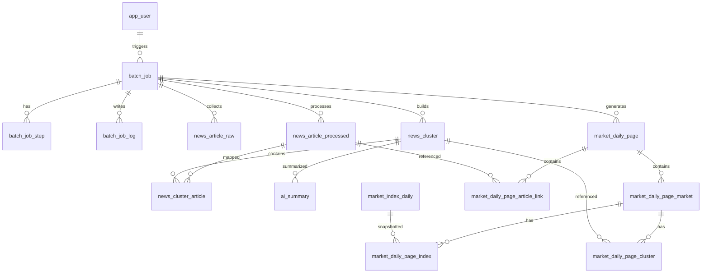

# Market Daily Brief MariaDB DDL 설계

## 1. 문서 목적

이 문서는 `docs/Product_Requirement_Document.md`와 `docs/api_spec_doc.md`를 기준으로, `Market Daily Brief`의 백엔드 및 배치 서버에서 사용할 MariaDB 스키마를 설계한다.

범위는 다음을 포함한다.

- 일간 통합 페이지 스냅샷 저장
- 뉴스 수집, 정제, 클러스터링 저장
- 시장 지수 저장
- AI 요약 저장
- 배치 실행 이력 및 운영 로그 저장
- API 조회 패턴에 맞는 인덱스 및 제약 설계

## 2. 합의된 정책

PRD의 “반드시 합의되어야 할 정책”에 따라 아래 기준을 확정한다.

| 항목 | 확정 정책 |
| --- | --- |
| `businessDate` 기준 | 무조건 한국 시간(UTC+9) 기준 날짜를 사용한다. |
| 페이지 재생성 정책 | 기존 페이지를 덮어쓰지 않고 항상 새 `version_no`를 생성한다. |
| 인증 저장 정책 | JWT는 별도 인증 서비스에서 발급하되, 우리 DB에는 JWT에서 추출한 `user_id`를 배치/운영 로그에 저장한다. |
| 대표 기사 선정 정책 | 대표 기사는 배치 시점에 확정 저장한다. |

## 3. 설계 원칙

### 3-1. 저장 전략

- 화면 조회 API는 스냅샷 우선 구조를 사용한다.
- 원본 수집 데이터와 화면 렌더링 데이터는 분리 저장한다.
- 과거 재현성과 운영 추적성을 위해 배치 결과와 페이지 버전은 모두 히스토리로 남긴다.

### 3-2. MariaDB 기준 선택

- PK는 API 예시와 운영 편의성을 고려해 `BIGINT UNSIGNED AUTO_INCREMENT`를 기본으로 사용한다.
- 외부 노출 식별자 중 UUID가 명시된 `cluster_id`는 `CHAR(36)`로 저장한다.
- 배열/객체형 응답 재현이 필요한 스냅샷 보조 필드는 `JSON`을 사용한다.
- 상태값은 MariaDB `CHECK` 의존 대신 코드 레벨과 `VARCHAR + CHECK`를 병행하되, 핵심 상태는 제약으로 방어한다.

### 3-3. 정규화 전략

- 수집/정제/클러스터/지수/배치 이력은 3NF에 가깝게 정규화한다.
- 페이지 응답은 빠른 조회를 위해 스냅샷 테이블과 하위 구성 테이블을 함께 둔다.
- 화면 1회 응답 보장을 위해 일부 요약 JSON은 중복 저장을 허용한다.

## 4. 핵심 엔터티

| 엔터티 | 설명 |
| --- | --- |
| `app_user` | 외부 인증 서비스와 동일 스키마를 전제로 참조하는 사용자 |
| `batch_job` | 통합 배치 실행 이력 |
| `batch_job_step` | 단계별 처리 결과 |
| `batch_job_log` | 운영용 로그 이벤트 |
| `news_article_raw` | 외부 수집 원본 뉴스 |
| `news_article_processed` | 정제/중복 제거 후 기사 |
| `news_cluster` | 이슈 클러스터 |
| `news_cluster_article` | 클러스터-기사 매핑 |
| `market_index_daily` | 시장별 대표 지수 일자 데이터 |
| `ai_summary` | 시장/클러스터/페이지 요약 결과 |
| `market_daily_page` | 페이지 헤더 단위 스냅샷 |
| `market_daily_page_market` | 페이지 내 시장 섹션 |
| `market_daily_page_index` | 시장 섹션별 지수 카드 |
| `market_daily_page_cluster` | 시장 섹션별 핵심 뉴스 카드 |
| `market_daily_page_article_link` | 페이지 하단 기사 링크 |

## 5. 상태 및 코드 체계

### 5-1. 페이지 상태

- `READY`
- `PARTIAL`
- `FAILED`

### 5-2. 배치 상태

- `PENDING`
- `RUNNING`
- `SUCCESS`
- `PARTIAL`
- `FAILED`
- `CANCELLED`

### 5-3. 시장 코드

- `US`
- `KR`

### 5-4. AI 요약 타입

- `GLOBAL_HEADLINE`
- `MARKET_SUMMARY`
- `CLUSTER_SUMMARY`
- `CLUSTER_ANALYSIS`
- `PAGE_REBUILD_REASON`

## 6. 관계 구조

## 7. 테이블별 설계

### 7-1. `app_user`

별도 인증 서비스와 동일 스키마를 사용하는 전제를 둔다. 인증 서비스가 이미 `app_user`를 생성·관리한다면 본 서비스 DDL에서는 재생성하지 않고 FK 참조만 맞추면 된다. 이번 범위에서는 최소 참조 컬럼만 사용한다.

핵심 컬럼:

- `id`: 사용자 ID
- `email`
- `display_name`
- `status`

### 7-2. `batch_job`

배치 목록 API와 상세 API의 기준 테이블이다.

핵심 컬럼:

- `job_name`
- `business_date`
- `status`
- `force_run`
- `rebuild_page_only`
- `requested_by_user_id`
- `started_at`, `ended_at`
- `raw_news_count`, `processed_news_count`, `cluster_count`
- `page_id`, `page_version_no`
- `partial_message`, `error_code`, `error_message`, `log_summary`

중요 제약:

- 같은 `business_date`에 대해 `RUNNING` 배치가 동시 생성되지 않도록 애플리케이션 락 또는 유니크 정책이 필요하다.
- MariaDB에서는 “상태가 RUNNING일 때만 유니크” 부분 인덱스가 제한적이므로, 애플리케이션 레벨 중복 실행 방지를 병행한다.

### 7-3. `batch_job_step`

배치 세부 단계 추적용이다.

예상 단계:

- `COLLECT_NEWS`
- `PROCESS_NEWS`
- `COLLECT_INDEX`
- `GENERATE_AI`
- `BUILD_PAGE`
- `FINALIZE`

### 7-4. `news_article_raw`

수집 API 응답 원문을 보존한다.

핵심 컬럼:

- `provider_name`
- `market_type`
- `business_date`
- `query_group`
- `provider_article_key`
- `title`, `body_text`
- `publisher_name`
- `published_at`
- `origin_link`, `naver_link`
- `payload_json`
- `collected_at`

유니크 권장:

- `(provider_name, provider_article_key)`
- provider key가 불안정하면 `(provider_name, origin_link(191))` 보조 검토

### 7-5. `news_article_processed`

중복 제거 이후 화면과 클러스터의 기준 기사다.

핵심 컬럼:

- `raw_article_id`
- `business_date`
- `market_type`
- `dedupe_key`
- `title`
- `normalized_title`
- `publisher_name`
- `published_at`
- `origin_link`, `naver_link`
- `source_summary`
- `is_representative_candidate`

### 7-6. `news_cluster`

클러스터 상세 API의 기준 테이블이다.

핵심 컬럼:

- `cluster_id`: 외부 노출 UUID
- `business_date`
- `market_type`
- `title`
- `summary_short`
- `summary_long`
- `analysis_json`
- `tags_json`
- `representative_article_id`
- `article_count`
- `sort_order`
- `last_updated_at`

중요 정책:

- 대표 기사 ID는 배치 시점에 확정 저장한다.
- `business_date + market_type` 기준으로 상위 클러스터 정렬 순서를 고정 저장한다.

### 7-7. `news_cluster_article`

클러스터와 정제 기사 다대다 매핑이다.

핵심 컬럼:

- `cluster_id`
- `processed_article_id`
- `is_representative`
- `article_order`

### 7-8. `market_index_daily`

일자별 지수 원본 및 표준화 결과다.

핵심 컬럼:

- `business_date`
- `market_type`
- `index_code`
- `index_name`
- `close_price`
- `change_value`
- `change_percent`
- `high_price`
- `low_price`
- `provider_name`

유니크:

- `(business_date, market_type, index_code)`

### 7-9. `ai_summary`

AI 생성 결과와 프롬프트 버전을 남긴다.

핵심 컬럼:

- `summary_type`
- `target_type`
- `target_id`
- `business_date`
- `market_type`
- `prompt_version`
- `model_name`
- `input_hash`
- `content_json`
- `fallback_used`
- `status`

### 7-10. `market_daily_page`

페이지 헤더 단위 스냅샷이다.

핵심 컬럼:

- `business_date`
- `version_no`
- `page_title`
- `status`
- `global_headline`
- `generated_at`
- `partial_message`
- `raw_news_count`, `processed_news_count`, `cluster_count`
- `markets_json`, `article_links_json`, `metadata_json`
- `source_batch_job_id`

중요 제약:

- `(business_date, version_no)` 유니크
- “최신 버전 조회”를 위해 `(business_date, version_no desc)` 인덱스 필요

### 7-11. `market_daily_page_market`

페이지 내 미국/한국 섹션 스냅샷이다.

핵심 컬럼:

- `page_id`
- `market_type`
- `market_label`
- `summary_title`
- `summary_body`
- `analysis_background_json`
- `analysis_key_themes_json`
- `analysis_outlook`
- `raw_news_count`, `processed_news_count`, `cluster_count`
- `partial_message`
- `sort_order`

유니크:

- `(page_id, market_type)`

### 7-12. `market_daily_page_index`

시장 섹션의 지수 카드 스냅샷이다.

핵심 컬럼:

- `page_market_id`
- `source_index_id`
- `index_code`
- `index_name`
- 가격/등락 수치
- `sort_order`

### 7-13. `market_daily_page_cluster`

핵심 뉴스 카드 스냅샷이다.

핵심 컬럼:

- `page_market_id`
- `source_cluster_id`
- `cluster_id`
- `title`
- `summary`
- `article_count`
- `tags_json`
- 대표 기사 필드 일체
- `sort_order`

### 7-14. `market_daily_page_article_link`

페이지 하단 기사 링크 스냅샷이다.

핵심 컬럼:

- `page_id`
- `page_market_id`
- `processed_article_id`
- `cluster_id`
- `cluster_title`
- `title`
- `publisher_name`
- `published_at`
- `origin_link`
- `naver_link`
- `sort_order`

## 8. 인덱스 전략

### 8-1. 조회 중심 인덱스

- `batch_job (business_date, started_at desc)`
- `batch_job (status, started_at desc)`
- `market_daily_page (business_date, version_no desc)`
- `market_daily_page (generated_at desc)`
- `news_cluster (cluster_id)`
- `news_cluster (business_date, market_type, sort_order)`
- `news_article_processed (business_date, market_type, published_at desc)`
- `market_index_daily (business_date, market_type, index_code)`

### 8-2. 조인 중심 인덱스

- `news_cluster_article (cluster_id, article_order)`
- `news_cluster_article (processed_article_id, cluster_id)`
- `market_daily_page_market (page_id, sort_order)`
- `market_daily_page_index (page_market_id, sort_order)`
- `market_daily_page_cluster (page_market_id, sort_order)`
- `market_daily_page_article_link (page_id, sort_order)`

### 8-3. 운영 보조 인덱스

- `batch_job (requested_by_user_id, started_at desc)`
- `batch_job_step (job_id, step_name)`
- `batch_job_log (job_id, created_at desc)`

## 9. API 매핑

### 9-1. `GET /pages/daily/latest`

조회 순서:

1. `market_daily_page`에서 최신 `generated_at` 또는 최신 `business_date/version_no` 1건 조회
2. `market_daily_page_market`
3. `market_daily_page_index`
4. `market_daily_page_cluster`
5. `market_daily_page_article_link`

### 9-2. `GET /pages/daily`

입력:

- `businessDate`
- `versionNo` optional

조회:

- `versionNo` 없으면 해당 `business_date`의 최대 `version_no`

### 9-3. `GET /pages/archive`

기준 테이블:

- `market_daily_page`

필드:

- `page_id`
- `business_date`
- `page_title`
- `global_headline` as `headlineSummary`
- `status`
- `generated_at`
- `partial_message`

### 9-4. `GET /news/clusters/{clusterId}`

기준 테이블:

- `news_cluster`
- `news_cluster_article`
- `news_article_processed`

### 9-5. `GET /batch/jobs`

기준 테이블:

- `batch_job`

### 9-6. `GET /batch/jobs/{jobId}`

기준 테이블:

- `batch_job`
- 필요 시 `batch_job_step`, `batch_job_log`

## 10. MariaDB DDL 초안 파일

실행 가능한 DDL 초안은 아래 파일에 분리한다.

- `db/schema_mariadb.sql`

## 11. 보완 권장 사항

### 11-1. 중복 실행 방지

MariaDB는 PostgreSQL처럼 부분 유니크 인덱스 활용이 제한적이므로 아래 둘 중 하나를 권장한다.

- 애플리케이션 레벨에서 `GET_LOCK('market_daily:{businessDate}', timeout)` 사용
- 별도 락 테이블 도입 후 `business_date` 유니크 제어

### 11-2. JSON 사용 범위

스냅샷 재현성과 구현 속도 때문에 JSON을 일부 허용했지만, 운영 질의가 많아지면 아래는 별도 컬럼 유지가 유리하다.

- 클러스터 태그
- 분석 문단
- 페이지 메타

### 11-3. 파티셔닝

초기 MVP에는 불필요하다. 다만 기사 수집량이 커지면 아래 테이블은 월 단위 파티셔닝 후보가 된다.

- `news_article_raw`
- `news_article_processed`
- `batch_job_log`
