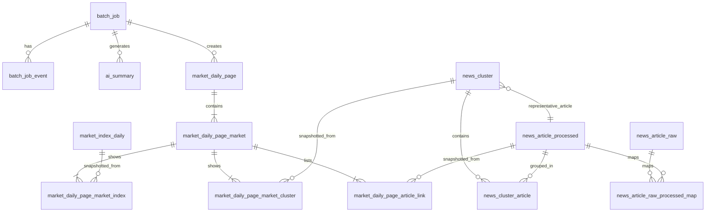

# Market Daily Brief PostgreSQL DDL 설계

## 1. 문서 목적

본 문서는 아래 두 문서를 기준으로 백엔드 API 서버와 배치 서버가 공통으로 사용할 PostgreSQL 스키마를 설계한다.

- `docs/Product_Requirement_Document.md`
- `docs/api_spec_doc.md`

목표는 다음 4가지를 동시에 만족하는 것이다.

1. 뉴스 수집, 정제, 클러스터링, AI 요약, 페이지 생성의 원천 데이터를 보존한다.
2. Frontend가 페이지별 API 1회 호출로 화면을 렌더링할 수 있도록 스냅샷 중심 조회 모델을 제공한다.
3. 동일 `business_date`에 대한 재생성과 과거 버전 재현을 안정적으로 지원한다.
4. 운영자가 배치 성공/실패/부분 실패 원인을 빠르게 확인할 수 있도록 감사 로그와 집계 수치를 보존한다.

권장 환경:

- PostgreSQL 15 이상
- `pgcrypto` extension 사용 가능

---

## 2. 합의된 정책

PRD의 "반드시 합의되어야 할 정책" 중 이번 설계에 반영된 확정 사항은 다음과 같다.

- `businessDate`는 무조건 한국 시간(`Asia/Seoul`, UTC+9) 기준 날짜를 사용한다.
- 페이지 재생성은 히스토리 보존을 위해 기존 페이지를 덮어쓰지 않고 항상 새 `version_no`를 생성한다.
- 인증은 별도 JWT 서비스를 사용하되, 운영/배치 감사 로그에는 JWT에서 추출한 `user_id`를 저장한다.
- 대표 기사는 배치 시점에 대표 기사 ID를 확정 저장한다.

이번 문서에 반영한 해석:

- `business_date`는 시장 데이터의 귀속일이며, 생성 시각과 분리된 별도 `DATE` 컬럼으로 저장한다.
- 재생성된 페이지는 항상 같은 `business_date` 내에서 `version_no`를 증가시킨다.
- `triggered_by_user_id`는 UUID 값을 저장한다. 실제 사용자 테이블 FK 연결은 인증 스키마 확정 시점에 추가한다.
- 클러스터 상세와 페이지 카드에 노출되는 대표 기사는 조회 시 계산이 아니라 저장 시점 확정값을 사용한다.

아직 운영 정책으로 남겨둘 수 있는 항목:

- `FAILED`와 `PARTIAL`의 세부 판정 기준
- AI fallback 문구 표준화 규칙
- `articleLinks`를 API 응답에서 최상위 배열로 평탄화할지, 시장별로 유지할지에 대한 최종 직렬화 방식

---

## 3. 문서 분석 요약

### 3-1. 핵심 도메인

문서 기준 핵심 엔터티는 아래 7개 축으로 정리된다.

- 배치 실행 이력
- 원본 뉴스 수집 결과
- 정제 기사
- 뉴스 클러스터와 대표 기사
- 시장별 대표 지수 일간 값
- AI 생성 요약/분석 결과
- 렌더링용 통합 페이지 스냅샷

### 3-2. API가 요구하는 조회 패턴

- 최신 페이지 조회: 가장 최근 `business_date`의 최신 `version_no`
- 날짜별 페이지 조회: 특정 `business_date`의 최신 또는 지정 `version_no`
- 아카이브 조회: 페이지 스냅샷 헤더만으로 목록 렌더링
- 클러스터 상세 조회: 클러스터, 대표 기사, 관련 기사, 분석 문단을 1회 호출로 반환
- 배치 목록 조회: 배치 이력 목록과 요약 통계를 한 번에 반환
- 배치 상세 조회: 선택한 배치의 상태, 집계, 오류, 로그 요약을 반환

### 3-3. 스냅샷 계층이 필요한 이유

PRD FR-13과 API 공통 규칙은 “Frontend가 추가 조합 없이 렌더링 가능해야 한다”는 요구를 강하게 전제한다. 따라서 원천 테이블만으로 조회 시점에 조립하는 구조보다 아래 2계층 구조가 적합하다.

- 원천 계층: 수집/정제/클러스터/지수/AI 요약/배치 로그
- 스냅샷 계층: 페이지 헤더/시장 섹션/지수 카드/클러스터 카드/기사 링크

이 구조를 쓰면 아래가 동시에 가능하다.

- 과거 버전 재현성 보장
- 페이지 조회 쿼리 단순화
- 배치 재생성 시 원천 재활용
- 원천 데이터 수정과 렌더링 결과의 분리

### 3-4. 문서 간 불일치와 설계 방침

`articleLinks` 위치는 문서 간 약간 다르다.

- PRD: 페이지 하단용 최상위 `articleLinks[]`
- API 예시: `markets[].articleLinks[]`

DB 설계는 기사 링크가 본질적으로 `market_type` 문맥을 갖는다고 보고 시장 단위로 저장한다. 응답 직렬화 시에는 아래 두 방식 모두 지원 가능하다.

- `markets[].articleLinks[]` 그대로 반환
- 시장별 링크를 합쳐 최상위 `articleLinks[]`로 평탄화

---

## 4. 설계 원칙

### 4-1. 키 전략

- 내부 PK는 `BIGINT GENERATED ALWAYS AS IDENTITY`
- 외부 노출 식별자는 UUID 사용
- 클러스터 API의 `clusterId`는 `news_cluster.cluster_uid UUID`
- 인증 사용자 식별자는 `UUID`

### 4-2. 시간 전략

- `business_date`: KST 기준 `DATE`
- 이벤트 시각: `TIMESTAMPTZ`
- DB 저장 시각은 UTC 기반 `TIMESTAMPTZ`로 저장하고, `business_date`만 KST 기준으로 계산한다.

권장 규칙:

- 배치 시작 시 `business_date = (now() AT TIME ZONE 'Asia/Seoul')::date` 또는 명시 입력값 사용
- API 응답 직렬화는 KST 기준 포맷 정책을 애플리케이션에서 통일

### 4-3. 상태값 전략

- 페이지 상태: `READY`, `PARTIAL`, `FAILED`
- 배치 상태: `PENDING`, `RUNNING`, `SUCCESS`, `PARTIAL`, `FAILED`
- AI 상태: `SUCCESS`, `FAILED`, `FALLBACK`
- 이벤트 레벨: `INFO`, `WARN`, `ERROR`

### 4-4. 정규화 전략

- 운영 원천 데이터는 3NF에 가깝게 설계
- 스냅샷 계층은 렌더링 안정성을 위해 의도적으로 부분 비정규화
- 태그 검색 요구가 없으므로 클러스터 태그는 `JSONB` 배열로 저장

### 4-5. 무결성 전략

- 동일 `business_date`에 대해 `PENDING`, `RUNNING` 배치는 1건만 허용
- `(business_date, version_no)`는 유일
- 대표 기사는 실제 클러스터 소속 기사만 허용
- 클러스터 노출 순서와 기사 노출 순서는 각각 유일하게 관리

### 4-6. 성능 전략

- 조회 API는 스냅샷 테이블 중심으로 구성
- 배치 목록/아카이브/최신 페이지 조회에 맞춘 복합 인덱스 제공
- FK 컬럼은 Postgres가 자동 인덱싱하지 않으므로 명시 인덱스를 기본 적용
- 목록성 API는 필요한 경우 `INCLUDE`를 사용한 covering index로 heap fetch를 줄임
- JSONB는 메타데이터와 분석 블록 저장에만 사용하고, 핵심 필터 컬럼은 정규 컬럼으로 유지

---

## 5. 제안 스키마 개요

### 5-1. 운영/배치

- `batch_job`
- `batch_job_event`

### 5-2. 뉴스 수집/정제

- `news_search_keyword`
- `news_article_raw`
- `news_article_processed`
- `news_article_raw_processed_map`

### 5-3. 클러스터

- `news_cluster`
- `news_cluster_article`

### 5-4. 시장 지수

- `market_index_daily`

### 5-5. AI 요약

- `ai_summary`

### 5-6. 페이지 스냅샷

- `market_daily_page`
- `market_daily_page_market`
- `market_daily_page_market_index`
- `market_daily_page_market_cluster`
- `market_daily_page_article_link`

---

## 6. 엔터티 상세 설계

### 6-1. `batch_job`

역할:

- 통합 일간 배치 실행 단위
- 중복 실행 방지 기준
- 재실행/재생성 이력 보존
- 운영 화면 목록/상세 응답의 원천

핵심 컬럼:

- `business_date`
- `status`
- `trigger_type`
- `triggered_by_user_id`
- `force_run`
- `rebuild_page_only`
- `raw_news_count`, `processed_news_count`, `cluster_count`
- `page_id`, `page_version_no`
- `partial_message`, `error_code`, `error_message`, `log_summary`

핵심 제약:

- 같은 `business_date`에 `PENDING`, `RUNNING` 상태는 동시에 1건만 허용
- `ended_at >= started_at`
- `duration_seconds >= 0`

### 6-2. `batch_job_event`

역할:

- 배치 상세 패널용 단계별 이벤트 기록
- 외부 API 실패, 재시도, fallback, 부분 실패 사유 추적

권장 사용 예:

- `COLLECT_NEWS`
- `COLLECT_INDEX`
- `DEDUPE_ARTICLES`
- `BUILD_CLUSTERS`
- `GENERATE_SUMMARY`
- `BUILD_PAGE`

설계 메모:

- 이벤트 조회는 대부분 `batch_job_id + created_at` 기준이므로 FK 인덱스를 별도로 유지한다.

### 6-3. `news_article_raw`

역할:

- 외부 뉴스 API 원본 응답 보존
- 검색 키워드, 제공자, 원시 payload 추적
- 재처리와 디버깅의 기준점

핵심 컬럼:

- `provider_name`
- `provider_article_key`
- `market_type`
- `business_date`
- `search_keyword`
- `title`
- `publisher_name`
- `published_at`
- `origin_link`, `naver_link`
- `payload_json`

유니크 기준:

- `(provider_name, provider_article_key)`

### 6-3-a. `news_search_keyword`

역할:

- 뉴스 수집용 검색 키워드 catalog
- 시장별/제공자별 수집 대상 관리
- 향후 관리자 API를 통한 생성, 수정, 활성/비활성 전환의 기준

핵심 컬럼:

- `provider_name`
- `market_type`
- `keyword`
- `is_active`
- `priority`
- `created_at`
- `updated_at`

핵심 제약:

- 동일 제공자/시장 내에서 정규화된 키워드 중복 금지
- `priority > 0`
- 공백 키워드 금지

설계 메모:

- 물리 삭제보다 `is_active = false` 방식의 비활성화를 기본 운영 정책으로 권장
- 향후 관리 API는 정렬 우선순위 변경과 활성/비활성 전환을 자주 수행할 수 있으므로 `updated_at`를 기본 보존 컬럼으로 둔다.
- 중복 방지는 `(provider_name, market_type, lower(btrim(keyword)))` 기준의 유니크 인덱스로 처리한다.

### 6-4. `news_article_processed`

역할:

- 중복 제거와 정제 이후의 표준 기사
- 페이지 하단 링크, 대표 기사, 클러스터 상세 기사 목록의 기준

핵심 컬럼:

- `business_date`
- `market_type`
- `dedupe_hash`
- `canonical_title`
- `publisher_name`
- `published_at`
- `origin_link`, `naver_link`
- `source_summary`
- `article_body_excerpt`
- `content_json`

유니크 기준:

- `dedupe_hash`

설계 메모:

- `dedupe_hash`는 URL, 제목 정규화, 매체, 본문 유사도 기준 조합으로 애플리케이션에서 생성
- 향후 기사 본문 전문 저장이 필요해지면 별도 컬럼 또는 테이블 분리 가능
- 길이 정책이 명확하지 않은 문자열은 `VARCHAR(n)`보다 `TEXT`를 우선 사용한다.

### 6-5. `news_article_raw_processed_map`

역할:

- 어떤 원본 기사들이 어느 정제 기사로 병합되었는지 추적
- 품질 모니터링과 디버깅 지원

### 6-6. `news_cluster`

역할:

- 동일 이슈 기사 집합의 헤더
- 클러스터 카드와 클러스터 상세 API의 중심 엔터티

핵심 컬럼:

- `cluster_uid`
- `business_date`
- `market_type`
- `cluster_rank`
- `title`
- `summary_short`
- `summary_long`
- `analysis_paragraphs_json`
- `tags_json`
- `representative_article_id`
- `article_count`

핵심 제약:

- `cluster_uid` 유일
- `(business_date, market_type, cluster_rank)` 유일
- 대표 기사는 클러스터 소속 기사여야 함

### 6-7. `news_cluster_article`

역할:

- 클러스터와 정제 기사 매핑
- 기사 노출 순서와 대표 기사 무결성 보조

핵심 제약:

- `(cluster_id, processed_article_id)` PK
- `(cluster_id, article_rank)` 유일

### 6-8. `market_index_daily`

역할:

- 시장별 대표 지수의 일간 값 저장
- 페이지 스냅샷 생성의 원천

핵심 컬럼:

- `business_date`
- `market_type`
- `index_code`
- `index_name`
- `close_price`
- `change_value`
- `change_percent`
- `high_price`, `low_price`
- `currency_code`
- `provider_name`

유니크 기준:

- `(business_date, market_type, index_code)`

### 6-9. `ai_summary`

역할:

- 글로벌 헤드라인, 시장 요약, 클러스터 카드 요약, 상세 분석의 생성 결과 저장
- 모델명, 프롬프트 버전, fallback 여부 추적

핵심 컬럼:

- `summary_type`
- `business_date`
- `market_type`
- `cluster_id`
- `title`
- `body`
- `paragraphs_json`
- `model_name`
- `prompt_version`
- `status`
- `fallback_used`
- `error_message`
- `metadata_json`

설계 메모:

- 최종 렌더링은 스냅샷에 복사 저장한다.
- `rebuild_page_only=true`인 경우 원천 기사/지수 재수집 없이 AI와 페이지 스냅샷만 새로 생성할 수 있다.
- `batch_job_id`, `cluster_id`는 FK 조인과 삭제 성능을 위해 단독 인덱스를 둔다.

### 6-10. `market_daily_page`

역할:

- 통합 일간 페이지의 헤더 스냅샷
- 아카이브, 최신 페이지, 날짜별 페이지 조회의 진입점

핵심 컬럼:

- `business_date`
- `version_no`
- `page_title`
- `status`
- `global_headline`
- `partial_message`
- `generated_at`
- 집계 수치
- `batch_job_id`
- `metadata_json`

핵심 제약:

- `(business_date, version_no)` 유일
- 집계 수치는 음수가 될 수 없음

설계 메모:

- `batch_job_id`, `business_date`, `status`는 목록/상세 조회와 운영 조인을 고려해 별도 인덱스 전략을 둔다.

### 6-11. `market_daily_page_market`

역할:

- 페이지 내 미국/한국 시장 섹션 스냅샷
- API의 `markets[]`에 직접 대응

핵심 컬럼:

- `page_id`
- `market_type`
- `display_order`
- `market_label`
- `summary_title`
- `summary_body`
- `analysis_background_json`
- `analysis_key_themes_json`
- `analysis_outlook`
- 시장별 집계 수치
- `partial_message`
- `metadata_json`

핵심 제약:

- `(page_id, market_type)` 유일
- `(page_id, display_order)` 유일

### 6-12. `market_daily_page_market_index`

역할:

- 페이지 시장 섹션의 대표 지수 카드 스냅샷

설계 포인트:

- 원본 `market_index_daily`를 FK로 참조하되, 렌더링 값은 별도 컬럼에 복사 저장
- 과거 원천 데이터 수정이 있어도 페이지 재현 값은 변하지 않음

### 6-13. `market_daily_page_market_cluster`

역할:

- 시장 섹션의 핵심 뉴스 카드 스냅샷

포함 값:

- `cluster_uid`
- `title`
- `summary`
- `article_count`
- `tags_json`
- 대표 기사 표시용 필드

### 6-14. `market_daily_page_article_link`

역할:

- 페이지 하단 기사 링크 스냅샷
- 응답 직렬화 시 시장별 또는 최상위 배열로 변환 가능

설계 포인트:

- 기사 링크 자체는 페이지 섹션 문맥을 가지므로 `page_market_id` 기준 저장
- `cluster_id`, `cluster_uid`, `cluster_title`을 함께 저장해 하단 링크와 이슈 문맥을 연결

---

## 7. ERD



---

## 8. PostgreSQL DDL 초안

아래 DDL은 PostgreSQL 기준으로 바로 마이그레이션 파일의 출발점으로 사용할 수 있는 수준을 목표로 한다.

```sql
CREATE SCHEMA IF NOT EXISTS market;
SET search_path TO market, public;

CREATE EXTENSION IF NOT EXISTS pgcrypto;

CREATE TYPE market_type_enum AS ENUM ('US', 'KR');
CREATE TYPE page_status_enum AS ENUM ('READY', 'PARTIAL', 'FAILED');
CREATE TYPE batch_job_status_enum AS ENUM ('PENDING', 'RUNNING', 'SUCCESS', 'PARTIAL', 'FAILED');
CREATE TYPE batch_trigger_type_enum AS ENUM ('SCHEDULED', 'MANUAL', 'ADMIN_REBUILD');
CREATE TYPE ai_summary_status_enum AS ENUM ('SUCCESS', 'FAILED', 'FALLBACK');
CREATE TYPE ai_summary_type_enum AS ENUM (
    'GLOBAL_HEADLINE',
    'MARKET_SUMMARY',
    'CLUSTER_CARD_SUMMARY',
    'CLUSTER_DETAIL_ANALYSIS'
);
CREATE TYPE event_level_enum AS ENUM ('INFO', 'WARN', 'ERROR');

CREATE TABLE batch_job (
    id BIGINT GENERATED ALWAYS AS IDENTITY PRIMARY KEY,
    job_name TEXT NOT NULL DEFAULT 'market_daily_batch',
    business_date DATE NOT NULL,
    status batch_job_status_enum NOT NULL,
    trigger_type batch_trigger_type_enum NOT NULL DEFAULT 'SCHEDULED',
    triggered_by_user_id UUID NULL,
    force_run BOOLEAN NOT NULL DEFAULT FALSE,
    rebuild_page_only BOOLEAN NOT NULL DEFAULT FALSE,
    market_scope VARCHAR(20) NOT NULL DEFAULT 'GLOBAL',
    started_at TIMESTAMPTZ NOT NULL DEFAULT now(),
    ended_at TIMESTAMPTZ NULL,
    duration_seconds INTEGER NULL,
    raw_news_count INTEGER NOT NULL DEFAULT 0,
    processed_news_count INTEGER NOT NULL DEFAULT 0,
    cluster_count INTEGER NOT NULL DEFAULT 0,
    page_id BIGINT NULL,
    page_version_no INTEGER NULL,
    partial_message TEXT NULL,
    error_code TEXT NULL,
    error_message TEXT NULL,
    log_summary TEXT NULL,
    created_at TIMESTAMPTZ NOT NULL DEFAULT now(),
    updated_at TIMESTAMPTZ NOT NULL DEFAULT now(),
    CONSTRAINT chk_batch_job_duration_non_negative
        CHECK (duration_seconds IS NULL OR duration_seconds >= 0),
    CONSTRAINT chk_batch_job_counts_non_negative
        CHECK (
            raw_news_count >= 0
            AND processed_news_count >= 0
            AND cluster_count >= 0
        ),
    CONSTRAINT chk_batch_job_ended_after_started
        CHECK (ended_at IS NULL OR ended_at >= started_at),
    CONSTRAINT chk_batch_job_market_scope
        CHECK (market_scope = 'GLOBAL')
);

CREATE UNIQUE INDEX uq_batch_job_one_active_per_day
    ON batch_job (business_date)
    WHERE status IN ('PENDING', 'RUNNING');

CREATE INDEX idx_batch_job_list
    ON batch_job (business_date DESC, started_at DESC);

CREATE INDEX idx_batch_job_status_started_at
    ON batch_job (status, started_at DESC);

CREATE INDEX idx_batch_job_page_id
    ON batch_job (page_id);

CREATE TABLE batch_job_event (
    id BIGINT GENERATED ALWAYS AS IDENTITY PRIMARY KEY,
    batch_job_id BIGINT NOT NULL REFERENCES batch_job(id) ON DELETE CASCADE,
    step_code TEXT NOT NULL,
    level event_level_enum NOT NULL,
    message TEXT NOT NULL,
    context_json JSONB NOT NULL DEFAULT '{}'::jsonb,
    created_at TIMESTAMPTZ NOT NULL DEFAULT now()
);

CREATE INDEX idx_batch_job_event_job_created
    ON batch_job_event (batch_job_id, created_at);

CREATE TABLE news_search_keyword (
    id BIGINT GENERATED ALWAYS AS IDENTITY PRIMARY KEY,
    provider_name TEXT NOT NULL,
    market_type market_type_enum NOT NULL,
    keyword TEXT NOT NULL,
    is_active BOOLEAN NOT NULL DEFAULT TRUE,
    priority INTEGER NOT NULL DEFAULT 100,
    created_at TIMESTAMPTZ NOT NULL DEFAULT now(),
    updated_at TIMESTAMPTZ NOT NULL DEFAULT now(),
    CONSTRAINT chk_news_search_keyword_keyword_not_blank
        CHECK (length(btrim(keyword)) > 0),
    CONSTRAINT chk_news_search_keyword_provider_name_not_blank
        CHECK (length(btrim(provider_name)) > 0),
    CONSTRAINT chk_news_search_keyword_priority_positive
        CHECK (priority > 0)
);

CREATE UNIQUE INDEX uq_news_search_keyword_provider_market_keyword_norm
    ON news_search_keyword (provider_name, market_type, lower(btrim(keyword)));

CREATE INDEX idx_news_search_keyword_active_priority
    ON news_search_keyword (provider_name, market_type, is_active, priority, id);

CREATE TABLE news_article_raw (
    id BIGINT GENERATED ALWAYS AS IDENTITY PRIMARY KEY,
    provider_name TEXT NOT NULL,
    provider_article_key TEXT NOT NULL,
    market_type market_type_enum NOT NULL,
    business_date DATE NOT NULL,
    search_keyword TEXT NULL,
    title TEXT NOT NULL,
    publisher_name TEXT NULL,
    published_at TIMESTAMPTZ NULL,
    origin_link TEXT NULL,
    naver_link TEXT NULL,
    payload_json JSONB NOT NULL DEFAULT '{}'::jsonb,
    collected_at TIMESTAMPTZ NOT NULL DEFAULT now(),
    created_at TIMESTAMPTZ NOT NULL DEFAULT now(),
    CONSTRAINT uq_news_article_raw_provider_key
        UNIQUE (provider_name, provider_article_key)
);

CREATE INDEX idx_news_article_raw_business_market
    ON news_article_raw (business_date, market_type, published_at DESC);

CREATE TABLE news_article_processed (
    id BIGINT GENERATED ALWAYS AS IDENTITY PRIMARY KEY,
    business_date DATE NOT NULL,
    market_type market_type_enum NOT NULL,
    dedupe_hash CHAR(64) NOT NULL,
    canonical_title TEXT NOT NULL,
    publisher_name TEXT NULL,
    published_at TIMESTAMPTZ NULL,
    origin_link TEXT NOT NULL,
    naver_link TEXT NULL,
    source_summary TEXT NULL,
    article_body_excerpt TEXT NULL,
    content_json JSONB NOT NULL DEFAULT '{}'::jsonb,
    created_at TIMESTAMPTZ NOT NULL DEFAULT now(),
    updated_at TIMESTAMPTZ NOT NULL DEFAULT now(),
    CONSTRAINT uq_news_article_processed_dedupe_hash
        UNIQUE (dedupe_hash)
);

CREATE INDEX idx_news_article_processed_business_market
    ON news_article_processed (business_date, market_type, published_at DESC);

CREATE TABLE news_article_raw_processed_map (
    raw_article_id BIGINT NOT NULL REFERENCES news_article_raw(id) ON DELETE CASCADE,
    processed_article_id BIGINT NOT NULL REFERENCES news_article_processed(id) ON DELETE CASCADE,
    created_at TIMESTAMPTZ NOT NULL DEFAULT now(),
    PRIMARY KEY (raw_article_id, processed_article_id)
);

CREATE INDEX idx_news_article_raw_processed_map_processed
    ON news_article_raw_processed_map (processed_article_id);

CREATE TABLE news_cluster (
    id BIGINT GENERATED ALWAYS AS IDENTITY PRIMARY KEY,
    cluster_uid UUID NOT NULL DEFAULT gen_random_uuid(),
    business_date DATE NOT NULL,
    market_type market_type_enum NOT NULL,
    cluster_rank INTEGER NOT NULL,
    title TEXT NOT NULL,
    summary_short TEXT NULL,
    summary_long TEXT NULL,
    analysis_paragraphs_json JSONB NOT NULL DEFAULT '[]'::jsonb,
    tags_json JSONB NOT NULL DEFAULT '[]'::jsonb,
    representative_article_id BIGINT NOT NULL,
    article_count INTEGER NOT NULL DEFAULT 0,
    created_at TIMESTAMPTZ NOT NULL DEFAULT now(),
    updated_at TIMESTAMPTZ NOT NULL DEFAULT now(),
    CONSTRAINT uq_news_cluster_uid UNIQUE (cluster_uid),
    CONSTRAINT uq_news_cluster_rank UNIQUE (business_date, market_type, cluster_rank),
    CONSTRAINT chk_news_cluster_rank_positive CHECK (cluster_rank > 0),
    CONSTRAINT chk_news_cluster_article_count_non_negative CHECK (article_count >= 0)
);

CREATE INDEX idx_news_cluster_business_market
    ON news_cluster (business_date, market_type, cluster_rank);

CREATE TABLE news_cluster_article (
    cluster_id BIGINT NOT NULL REFERENCES news_cluster(id) ON DELETE CASCADE,
    processed_article_id BIGINT NOT NULL REFERENCES news_article_processed(id) ON DELETE RESTRICT,
    article_rank INTEGER NOT NULL,
    created_at TIMESTAMPTZ NOT NULL DEFAULT now(),
    PRIMARY KEY (cluster_id, processed_article_id),
    CONSTRAINT uq_news_cluster_article_rank UNIQUE (cluster_id, article_rank),
    CONSTRAINT chk_news_cluster_article_rank_positive CHECK (article_rank > 0)
);

CREATE INDEX idx_news_cluster_article_processed
    ON news_cluster_article (processed_article_id);

ALTER TABLE news_cluster
    ADD CONSTRAINT fk_news_cluster_representative_membership
    FOREIGN KEY (id, representative_article_id)
    REFERENCES news_cluster_article (cluster_id, processed_article_id)
    DEFERRABLE INITIALLY DEFERRED;

CREATE TABLE market_index_daily (
    id BIGINT GENERATED ALWAYS AS IDENTITY PRIMARY KEY,
    business_date DATE NOT NULL,
    market_type market_type_enum NOT NULL,
    index_code TEXT NOT NULL,
    index_name TEXT NOT NULL,
    close_price NUMERIC(20, 4) NOT NULL,
    change_value NUMERIC(20, 4) NOT NULL,
    change_percent NUMERIC(10, 4) NOT NULL,
    high_price NUMERIC(20, 4) NULL,
    low_price NUMERIC(20, 4) NULL,
    currency_code CHAR(3) NOT NULL,
    provider_name TEXT NOT NULL,
    collected_at TIMESTAMPTZ NOT NULL DEFAULT now(),
    created_at TIMESTAMPTZ NOT NULL DEFAULT now(),
    CONSTRAINT uq_market_index_daily UNIQUE (business_date, market_type, index_code)
);

CREATE INDEX idx_market_index_daily_business_market
    ON market_index_daily (business_date, market_type);

CREATE TABLE ai_summary (
    id BIGINT GENERATED ALWAYS AS IDENTITY PRIMARY KEY,
    batch_job_id BIGINT NOT NULL REFERENCES batch_job(id) ON DELETE CASCADE,
    summary_type ai_summary_type_enum NOT NULL,
    business_date DATE NOT NULL,
    market_type market_type_enum NULL,
    cluster_id BIGINT NULL REFERENCES news_cluster(id) ON DELETE CASCADE,
    title TEXT NULL,
    body TEXT NULL,
    paragraphs_json JSONB NOT NULL DEFAULT '[]'::jsonb,
    model_name TEXT NULL,
    prompt_version TEXT NULL,
    status ai_summary_status_enum NOT NULL,
    fallback_used BOOLEAN NOT NULL DEFAULT FALSE,
    error_message TEXT NULL,
    metadata_json JSONB NOT NULL DEFAULT '{}'::jsonb,
    generated_at TIMESTAMPTZ NOT NULL DEFAULT now()
);

CREATE INDEX idx_ai_summary_lookup
    ON ai_summary (business_date, summary_type, market_type, generated_at DESC);

CREATE INDEX idx_ai_summary_cluster
    ON ai_summary (cluster_id);

CREATE INDEX idx_ai_summary_batch_job
    ON ai_summary (batch_job_id);

CREATE TABLE market_daily_page (
    id BIGINT GENERATED ALWAYS AS IDENTITY PRIMARY KEY,
    business_date DATE NOT NULL,
    version_no INTEGER NOT NULL,
    page_title TEXT NOT NULL,
    status page_status_enum NOT NULL,
    global_headline TEXT NULL,
    partial_message TEXT NULL,
    generated_at TIMESTAMPTZ NOT NULL DEFAULT now(),
    raw_news_count INTEGER NOT NULL DEFAULT 0,
    processed_news_count INTEGER NOT NULL DEFAULT 0,
    cluster_count INTEGER NOT NULL DEFAULT 0,
    last_updated_at TIMESTAMPTZ NOT NULL DEFAULT now(),
    batch_job_id BIGINT NOT NULL REFERENCES batch_job(id) ON DELETE RESTRICT,
    metadata_json JSONB NOT NULL DEFAULT '{}'::jsonb,
    created_at TIMESTAMPTZ NOT NULL DEFAULT now(),
    CONSTRAINT uq_market_daily_page_business_version
        UNIQUE (business_date, version_no),
    CONSTRAINT chk_market_daily_page_version_positive
        CHECK (version_no > 0),
    CONSTRAINT chk_market_daily_page_counts_non_negative
        CHECK (
            raw_news_count >= 0
            AND processed_news_count >= 0
            AND cluster_count >= 0
        )
);

CREATE INDEX idx_market_daily_page_latest
    ON market_daily_page (business_date DESC, version_no DESC);

CREATE INDEX idx_market_daily_page_status_generated
    ON market_daily_page (status, generated_at DESC);

CREATE INDEX idx_market_daily_page_batch_job
    ON market_daily_page (batch_job_id);

CREATE INDEX idx_market_daily_page_archive_cover
    ON market_daily_page (business_date DESC, generated_at DESC)
    INCLUDE (id, page_title, global_headline, status, partial_message);

CREATE TABLE market_daily_page_market (
    id BIGINT GENERATED ALWAYS AS IDENTITY PRIMARY KEY,
    page_id BIGINT NOT NULL REFERENCES market_daily_page(id) ON DELETE CASCADE,
    market_type market_type_enum NOT NULL,
    display_order SMALLINT NOT NULL,
    market_label TEXT NOT NULL,
    summary_title TEXT NULL,
    summary_body TEXT NULL,
    analysis_background_json JSONB NOT NULL DEFAULT '[]'::jsonb,
    analysis_key_themes_json JSONB NOT NULL DEFAULT '[]'::jsonb,
    analysis_outlook TEXT NULL,
    raw_news_count INTEGER NOT NULL DEFAULT 0,
    processed_news_count INTEGER NOT NULL DEFAULT 0,
    cluster_count INTEGER NOT NULL DEFAULT 0,
    last_updated_at TIMESTAMPTZ NOT NULL DEFAULT now(),
    partial_message TEXT NULL,
    metadata_json JSONB NOT NULL DEFAULT '{}'::jsonb,
    CONSTRAINT uq_market_daily_page_market_type UNIQUE (page_id, market_type),
    CONSTRAINT uq_market_daily_page_market_order UNIQUE (page_id, display_order),
    CONSTRAINT chk_market_daily_page_market_order_positive CHECK (display_order > 0),
    CONSTRAINT chk_market_daily_page_market_counts_non_negative
        CHECK (
            raw_news_count >= 0
            AND processed_news_count >= 0
            AND cluster_count >= 0
        )
);

CREATE INDEX idx_market_daily_page_market_page
    ON market_daily_page_market (page_id, display_order);

CREATE TABLE market_daily_page_market_index (
    id BIGINT GENERATED ALWAYS AS IDENTITY PRIMARY KEY,
    page_market_id BIGINT NOT NULL REFERENCES market_daily_page_market(id) ON DELETE CASCADE,
    market_index_daily_id BIGINT NULL REFERENCES market_index_daily(id) ON DELETE SET NULL,
    display_order SMALLINT NOT NULL,
    index_code TEXT NOT NULL,
    index_name TEXT NOT NULL,
    close_price NUMERIC(20, 4) NOT NULL,
    change_value NUMERIC(20, 4) NOT NULL,
    change_percent NUMERIC(10, 4) NOT NULL,
    high_price NUMERIC(20, 4) NULL,
    low_price NUMERIC(20, 4) NULL,
    currency_code CHAR(3) NOT NULL,
    CONSTRAINT uq_market_daily_page_market_index_order
        UNIQUE (page_market_id, display_order),
    CONSTRAINT chk_market_daily_page_market_index_order_positive
        CHECK (display_order > 0)
);

CREATE INDEX idx_market_daily_page_market_index_market
    ON market_daily_page_market_index (page_market_id, display_order);

CREATE INDEX idx_market_daily_page_market_index_source
    ON market_daily_page_market_index (market_index_daily_id);

CREATE TABLE market_daily_page_market_cluster (
    id BIGINT GENERATED ALWAYS AS IDENTITY PRIMARY KEY,
    page_market_id BIGINT NOT NULL REFERENCES market_daily_page_market(id) ON DELETE CASCADE,
    cluster_id BIGINT NULL REFERENCES news_cluster(id) ON DELETE SET NULL,
    cluster_uid UUID NOT NULL,
    display_order SMALLINT NOT NULL,
    title TEXT NOT NULL,
    summary TEXT NULL,
    article_count INTEGER NOT NULL DEFAULT 0,
    tags_json JSONB NOT NULL DEFAULT '[]'::jsonb,
    representative_article_id BIGINT NULL REFERENCES news_article_processed(id) ON DELETE SET NULL,
    representative_title TEXT NULL,
    representative_publisher_name TEXT NULL,
    representative_published_at TIMESTAMPTZ NULL,
    representative_origin_link TEXT NULL,
    representative_naver_link TEXT NULL,
    CONSTRAINT uq_market_daily_page_market_cluster_order
        UNIQUE (page_market_id, display_order),
    CONSTRAINT chk_market_daily_page_market_cluster_order_positive
        CHECK (display_order > 0),
    CONSTRAINT chk_market_daily_page_market_cluster_article_count_non_negative
        CHECK (article_count >= 0)
);

CREATE INDEX idx_market_daily_page_market_cluster_market
    ON market_daily_page_market_cluster (page_market_id, display_order);

CREATE INDEX idx_market_daily_page_market_cluster_uid
    ON market_daily_page_market_cluster (cluster_uid);

CREATE INDEX idx_market_daily_page_market_cluster_cluster_id
    ON market_daily_page_market_cluster (cluster_id);

CREATE INDEX idx_market_daily_page_market_cluster_rep_article
    ON market_daily_page_market_cluster (representative_article_id);

CREATE TABLE market_daily_page_article_link (
    id BIGINT GENERATED ALWAYS AS IDENTITY PRIMARY KEY,
    page_market_id BIGINT NOT NULL REFERENCES market_daily_page_market(id) ON DELETE CASCADE,
    display_order INTEGER NOT NULL,
    processed_article_id BIGINT NULL REFERENCES news_article_processed(id) ON DELETE SET NULL,
    cluster_id BIGINT NULL REFERENCES news_cluster(id) ON DELETE SET NULL,
    cluster_uid UUID NULL,
    cluster_title TEXT NULL,
    title TEXT NOT NULL,
    publisher_name TEXT NULL,
    published_at TIMESTAMPTZ NULL,
    origin_link TEXT NOT NULL,
    naver_link TEXT NULL,
    CONSTRAINT uq_market_daily_page_article_link_order
        UNIQUE (page_market_id, display_order),
    CONSTRAINT chk_market_daily_page_article_link_order_positive
        CHECK (display_order > 0)
);

CREATE INDEX idx_market_daily_page_article_link_market
    ON market_daily_page_article_link (page_market_id, display_order);

CREATE INDEX idx_market_daily_page_article_link_processed
    ON market_daily_page_article_link (processed_article_id);

CREATE INDEX idx_market_daily_page_article_link_cluster
    ON market_daily_page_article_link (cluster_id);

ALTER TABLE batch_job
    ADD CONSTRAINT fk_batch_job_page
    FOREIGN KEY (page_id) REFERENCES market_daily_page(id) ON DELETE SET NULL;

CREATE OR REPLACE FUNCTION set_updated_at()
RETURNS TRIGGER AS $$
BEGIN
    NEW.updated_at = now();
    RETURN NEW;
END;
$$ LANGUAGE plpgsql;

CREATE TRIGGER trg_batch_job_updated_at
BEFORE UPDATE ON batch_job
FOR EACH ROW
EXECUTE FUNCTION set_updated_at();

CREATE TRIGGER trg_news_article_processed_updated_at
BEFORE UPDATE ON news_article_processed
FOR EACH ROW
EXECUTE FUNCTION set_updated_at();

CREATE TRIGGER trg_news_cluster_updated_at
BEFORE UPDATE ON news_cluster
FOR EACH ROW
EXECUTE FUNCTION set_updated_at();
```

---

## 9. 인덱스 전략 요약

### 9-1. 페이지 조회

- 최신 페이지: `idx_market_daily_page_latest`
- 날짜별 최신/특정 버전 조회: `uq_market_daily_page_business_version`, `idx_market_daily_page_latest`
- 아카이브 목록: `idx_market_daily_page_status_generated`, `idx_market_daily_page_archive_cover`

### 9-2. 배치 조회

- 최근 배치 목록: `idx_batch_job_list`
- 상태 필터 + 정렬: `idx_batch_job_status_started_at`
- 동일 일자 실행 중복 방지: `uq_batch_job_one_active_per_day`
- 페이지 조인: `idx_batch_job_page_id`

### 9-3. 뉴스/클러스터 조회

- 시장별 기사 조회: `idx_news_article_processed_business_market`
- 시장별 클러스터 조회: `idx_news_cluster_business_market`
- 클러스터 상세 기사 목록: `idx_news_cluster_article_processed`
- 외부 노출 UUID 조회: `uq_news_cluster_uid`
- 스냅샷 역참조 FK: `idx_market_daily_page_market_cluster_cluster_id`, `idx_market_daily_page_market_cluster_rep_article`, `idx_market_daily_page_article_link_processed`, `idx_market_daily_page_article_link_cluster`

### 9-4. AI 조회

- 같은 일자의 최신 생성 결과 탐색: `idx_ai_summary_lookup`
- 클러스터 요약 재사용: `idx_ai_summary_cluster`
- 배치별 생성 결과 조회: `idx_ai_summary_batch_job`

---

## 10. API 매핑

### 10-1. `GET /pages/daily/latest`

권장 순서:

1. `market_daily_page`에서 `business_date DESC, version_no DESC` 기준 1건
2. `market_daily_page_market`
3. `market_daily_page_market_index`
4. `market_daily_page_market_cluster`
5. `market_daily_page_article_link`

### 10-2. `GET /pages/daily?businessDate=...&versionNo=...`

- `versionNo` 미입력 시 같은 `business_date` 내 최대 `version_no`
- 스냅샷 계층만으로 응답 구성 가능

### 10-3. `GET /pages/archive`

주 테이블:

- `market_daily_page`

응답 매핑:

- `pageId` <- `id`
- `businessDate` <- `business_date`
- `pageTitle` <- `page_title`
- `headlineSummary` <- `global_headline`
- `status` <- `status`
- `generatedAt` <- `generated_at`
- `partialMessage` <- `partial_message`

### 10-4. `GET /news/clusters/{clusterId}`

권장 해석:

- Path의 `clusterId`는 `news_cluster.cluster_uid`

조합 테이블:

- `news_cluster`
- `news_article_processed` 대표 기사
- `news_cluster_article`
- `news_article_processed` 관련 기사 목록

### 10-5. `GET /batch/jobs`

주 테이블:

- `batch_job`

요약 통계:

- 같은 검색 조건 범위에서 `status`별 집계
- `avg(duration_seconds)` 계산

권장 인덱스 보강:

- 목록 조회 빈도가 높으면 `(status, business_date DESC, started_at DESC) INCLUDE (id, ended_at, duration_seconds, raw_news_count, processed_news_count, cluster_count, page_id, page_version_no, partial_message)` 형태의 covering index를 검토

### 10-6. `GET /batch/jobs/{jobId}`

주 테이블:

- `batch_job`
- 선택적으로 `batch_job_event`

---

## 11. 구현 권장 사항

### 11-1. `updated_at` 자동 갱신

PostgreSQL은 MySQL/MariaDB의 `ON UPDATE CURRENT_TIMESTAMP` 문법이 없다. 따라서 아래 중 하나를 권장한다.

- 공통 `set_updated_at()` 트리거 함수 사용
- 애플리케이션 서비스에서 명시 갱신

이번 DDL 초안에는 공통 트리거 함수를 포함했다. `updated_at` 컬럼이 있는 테이블이 늘어나면 같은 함수를 재사용해 트리거만 추가하면 된다.

### 11-2. 대표 기사 무결성

`news_cluster.representative_article_id`가 실제 클러스터 구성 기사인지 보장하기 위해 지연 가능 복합 FK를 사용했다.

장점:

- 대표 기사 ID 저장을 DB 레벨에서 검증 가능
- 같은 트랜잭션 내에서 클러스터와 클러스터 기사 매핑을 함께 삽입 가능

주의:

- 클러스터 insert 후 `news_cluster_article` insert, 마지막에 commit하는 흐름을 같은 트랜잭션으로 유지해야 한다.

### 11-3. 페이지 버전 생성

새 페이지 생성 시 권장 순서:

1. 트랜잭션 시작
2. `SELECT pg_advisory_xact_lock(hashtextextended('market_daily_page:' || :business_date::text, 0));`
3. `SELECT COALESCE(MAX(version_no), 0) + 1 FROM market_daily_page WHERE business_date = :business_date`
4. `market_daily_page` insert
5. `market_daily_page_market` insert
6. 하위 지수/클러스터/기사 링크 insert
7. `batch_job.page_id`, `page_version_no`, `status`, 집계값 갱신
8. commit

이 절차에서 advisory lock은 선택 사항이 아니라 필수다. `MAX(version_no) + 1` 계산만으로는 동시 재생성 경쟁을 안전하게 직렬화할 수 없다.

### 11-4. 시간대 처리

필수 규칙:

- `business_date` 계산은 반드시 `Asia/Seoul`
- DB 세션 타임존은 UTC로 유지해도 무방하나, 애플리케이션에서 KST 기준 비즈니스 날짜 계산을 일관되게 수행해야 함

예시:

```sql
SELECT (now() AT TIME ZONE 'Asia/Seoul')::date;
```

### 11-5. 스냅샷 메타데이터 범위

`metadata_json`에는 다음과 같은 보조 정보를 저장할 수 있다.

- 수집 소스별 건수
- 부분 실패 세부 코드 목록
- 생성에 사용된 프롬프트 버전
- UI 미노출 디버그용 집계

다만 조회 필터에 사용할 항목은 JSONB가 아니라 정규 컬럼으로 승격하는 것이 맞다.

### 11-6. FK 인덱스 원칙

Postgres는 FK를 자동 인덱싱하지 않는다. 따라서 아래처럼 읽기 조인 또는 삭제/갱신 연쇄가 발생하는 FK는 명시 인덱스를 둔다.

- `batch_job.page_id`
- `batch_job_event.batch_job_id`
- `ai_summary.batch_job_id`, `ai_summary.cluster_id`
- `market_daily_page.batch_job_id`
- `market_daily_page_market_index.market_index_daily_id`
- `market_daily_page_market_cluster.cluster_id`, `market_daily_page_market_cluster.representative_article_id`
- `market_daily_page_article_link.processed_article_id`, `market_daily_page_article_link.cluster_id`

### 11-7. 문자열 타입 원칙

길이 제한이 명확한 도메인 규칙이 없는 문자열은 `VARCHAR(n)` 대신 `TEXT`를 우선 사용한다.

예외:

- 상태값은 enum
- 통화 코드는 `CHAR(3)`
- 정말로 최대 길이가 계약된 외부 포맷이면 `VARCHAR(n)` 가능

### 11-8. 사용자 FK 연결

현재 문서에서는 `triggered_by_user_id UUID`만 저장한다. 인증 스키마가 확정되면 아래 중 하나로 확장한다.

- 동일 스키마의 `app_user(id UUID)`로 FK 연결
- 별도 인증 스키마 참조
- 감사 로그 목적상 비정규 FK 없이 UUID만 유지

---

## 12. 마이그레이션 및 운영 순서 권장

1. enum type 생성
2. 부모 테이블 생성
3. 자식 테이블 생성
4. partial unique index 생성
5. FK 보조 인덱스 생성
6. 지연 가능 복합 FK 추가
7. `updated_at` 트리거 함수 및 트리거 추가
8. 샘플 배치 데이터로 최신/날짜별/아카이브/클러스터 상세 쿼리 검증

운영 전 체크리스트:

- `business_date` 계산 로직이 KST 기준인지 확인
- 동일 날짜 배치 동시 실행이 partial unique index로 차단되는지 확인
- 재생성 시 `version_no`가 증가하는지 확인
- 대표 기사 무결성 제약이 정상 동작하는지 확인
- 스냅샷만으로 Frontend 응답을 구성할 수 있는지 확인

---

## 13. 후속 구현 Task 제안

### 13-1. 즉시 진행 권장

1. PostgreSQL 마이그레이션 파일 생성
2. `updated_at` 트리거 함수 추가
3. 페이지 최신/날짜별/아카이브 조회 SQL 또는 Repository 구현
4. 배치 실행 시 `version_no` 증가 로직 구현
5. 클러스터 상세 조회 SQL 구현

### 13-2. 다음 단계 권장

1. `FAILED`와 `PARTIAL` 세부 기준 문서화
2. 대표 기사 선정 알고리즘 명세화
3. 뉴스 dedupe 해시 생성 규칙 문서화
4. 인증 사용자 테이블 확정 후 FK 추가 여부 결정

---

## 14. 최종 결론

현재 요구사항에는 “원천 데이터 보존 + 스냅샷 조회 + 버전 이력 관리”를 동시에 만족하는 구조가 필요하다. 따라서 PostgreSQL 기준 최적 설계는 아래로 요약된다.

- 원천 계층과 스냅샷 계층을 분리한다.
- 페이지는 `business_date + version_no`로 버전 관리한다.
- 배치는 같은 `business_date`에 대해 실행 중 1건만 허용한다.
- 대표 기사는 클러스터 소속 기사 중 하나로 배치 시점에 확정 저장한다.
- `business_date`는 KST 기준으로 계산하고, 나머지 이벤트 시각은 `TIMESTAMPTZ`로 저장한다.

이 구조면 PRD와 API 명세가 요구하는 조회 패턴, 재현성, 운영성, 향후 확장성을 모두 무리 없이 수용할 수 있다.
